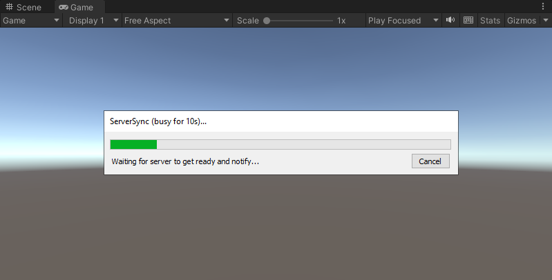
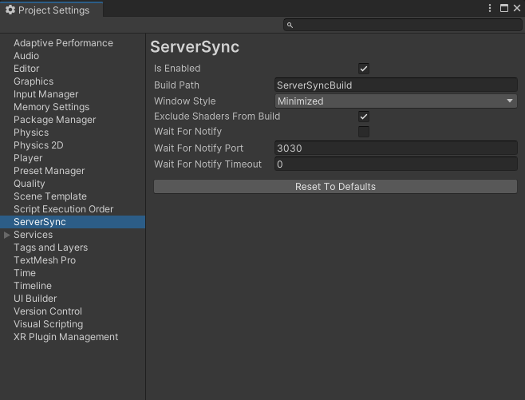

# About
ServerSync is for rapid iteration on multiplayer games.

It builds and launches a server executable when entering Play mode.

This relies on the fact that Mono server builds are actually very fast.

# Installation
Install the package [from its git URL](https://docs.unity3d.com/Manual/upm-ui-giturl.html) or [from a local copy](https://docs.unity3d.com/Manual/upm-ui-local.html).

# Guide
1. Install the package
2. Enter Play mode
    1. The server will be built
    2. The server executable will be launched (in a separate console window)
    3. Play mode will be entered
3. Exit Play mode
    1. The server process will be shut down

The separate console window displays the server's log/output.

The Wait/Notify feature can be used if there's a need to delay Play mode until the server is ready to accept clients. Details in the sections that follow.



# Settings


* **IsEnabled:** Global toggle to enable/disable the package
* **Build Path:** The directory where the server build should be stored
* **Window Style:** The server executable can start in a minimized or hidden state
* **Exclude Shaders From Build:** Skips all shaders during build to speed it up (recommended)
* **Wait for Notify:** Delays Play mode until the server notifies that it's ready to accept clients (by calling the `ServerSync.WaitNotifier.Instance.NotifyReady` function), a cancellable progress bar will be displayed
* **Wait for Notify Port:** The localhost port to use for the wait/notify connection
* **Wait for Notify Timeout:** How long to wait for the server to notify the editor before giving up. Disabled when the value is set to 0.

# API
To use the Wait/Notify feature, the server should make this call when it's ready to accept clients:

```c#
#if SERVER_SYNC
ServerSync.WaitNotifier.Instance.NotifyReady();
#endif
```

# Possible improvements
* EditorWindow to display redirected server output, especially useful when the hidden server window option is enabled
* Pass user-provided data along with `ServerSync.WaitNotifier.Instance.NotifyReady`
